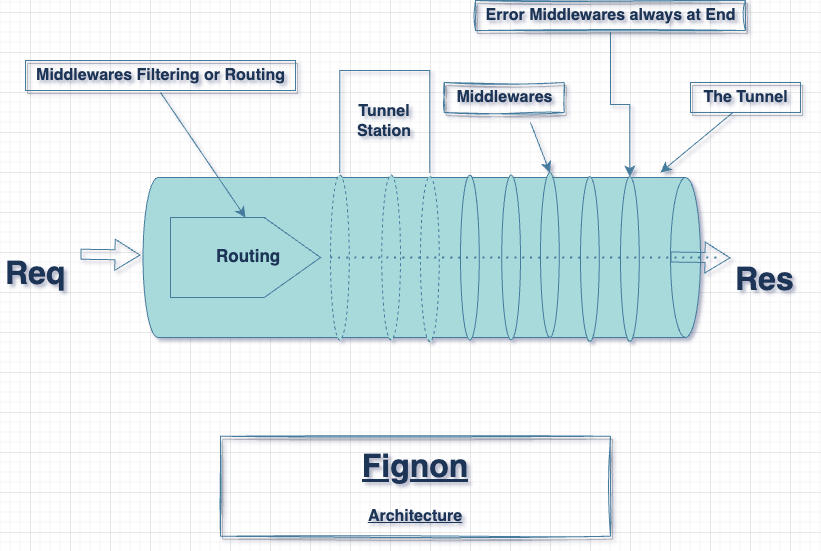

<h1 align="center">Fignon Framework</h1>

<p align="center" style="font-family: Montserrat">Fignon is an ExpressJs like framework for PHP. It is designed to be simple and easy to use.</p>




Fignon Framework is designed around a notion of `Tunnel`, `Tunnel Station`, `Middleware`, `Middleware Runner`.
It also has the strongest support for any view engine, database, orm, etc.

## App


The application itself is called a `Tunnel`. like real tunnel (👆). A `Tunnel` is a stack of `Tunnel Station`. A `Tunnel Station` is a middleware group which can be mounted in a common base path. Yes, you got it, both `Router` and `App` are both instance of `TunnelStation`. `TunnelStation` which expose apis to register middlewares like to register routes with specific http method and path like `$app->get('/', function (Request $req, Response $res) { /* ... */ })`.

The Tunnel is the `middleware runner`;

Middlewares can be easily grouped and mounted in a common base path. This is useful to create modular and reusable middlewares.

## Installation
You can install Fignon Framework with composer:
```bash
composer require fignon/fignon
```

For more, [see the project readme](https://github.com/FignonPhp)

If you need to start quickly a RESTful API or a Web app based on Fignon, consider using our skeleton:

```bash
composer create-project fignonphp/skeleton my-fignon-app
```


## Usage
Here is a simple example of a Fignon app that responds with "Hello World" when you visit the root URL:

Just copy and paste it after you have installed the framework with composer and run it with `php -S localhost:8000 -t public` and visit `http://localhost:8000` in your browser.

```php
<?php
declare(strict_types=1);

include_once __DIR__ . "/../vendor/autoload.php";

use Fignon\Tunnel;
use Fignon\Request\Request;
use Fignon\Response\Response;

$app = new Tunnel();

$app->get('/', function (Request $req, Response $res) {
    $res->status(200)->send('Hello World');
})->as('get_hello');

$app->listen();
```


## Settings Tables
Fignon allow you to store and use settings in a key-value pair. You can set a setting entry with `$app->set('env', 'development')` and get it with `$app->config('env')`. You can also check if a setting exists with `$app->has('env')` and delete it with `$app->remove('env')`.

Below are the internally used settings table by the app along with default value if applied:

| Setting               | Description                                                    | Default Value                                      |
|-----------------------|----------------------------------------------------------------|----------------------------------------------------|
| env                   | Environnement of the app. Can be test, development, production. | production                                         |
| baseUrl               | The hostname of the process. Default to $_SERVER['HTTP_HOST']        | $_SERVER['HTTP_HOST']                                   |
| debug                 | When to enable verbose and stack trace.                         | true/false based on env value                      |
| trust proxy           | Whether to trust proxy.                                        | -                                                  |
| x-powered-by          | Whether to hide the x-powered-by headers.                       | false                                              |
| views                 | Path to template dir to use with view engine.                  | -                                                  |
| view engine options   | Additional array of options to pass to the view engine.         | []                                               |
| views cache           | Path to the cache dir used by the view engine.                  | -                                     |
| case sensitive routing| Whether to use case-sensitive routing.                          | false                                              |
| view engine           | The active view engine of the app.                              | null                                               |

While you can set individual setting with `$app->set('env', 'development')`, you can also load config vars from file like:

```php
// You can set the config from a php file
$app->setFrom(dirname(__DIR__) . '/.env.local.php');
// And or add env variable coming from the global $_ENV
$app->setFromEnv();
// Or from a json file
$app->setFromJson(dirname(__DIR__) . '/config.json');
// Or from a yaml file
$app->setFromYaml(dirname(__DIR__) . '/config.yaml');
```
Those file must return an array of key-value pair supported in the settings table or containing your custom variables well formatted as key-value in an associative array.

## Request
The Request is an object that represents the HTTP request and has properties for the request query string, parameters, body, HTTP headers, and so on.

Fignon Request object is an instance of the `Fignon\Request\Request` class. It extends the well known `Symfony\Component\HttpFoundation\Request` class. So, you can use all the methods and properties of the Symfony Request class.


## Response

The Response is an object that represents the HTTP response and has properties for the response body, HTTP headers, status code, and so on.

Fignon Response object is an instance of the `Fignon\Response\Response` class. It extends the well known `Symfony\Component\HttpFoundation\Response` class. So, you can use all the methods and properties of the Symfony Response class.


## Middlewares

Middlewares are functions that have access to the request object (`req`), the response object (`res`), and the next middleware in the application’s `request-response cycle`. The next middleware is commonly denoted by a variable named `$next`.

Middlewares can perform the following tasks:

- [X] Execute any code.
- [X] Make changes to the request and the response objects.
- [X] End the request-response cycle.
- [X] Call the next middleware in the stack.

In Fignon, we distinguish between two types of middlewares: Application-level middlewares and Router-level middlewares.

Application-level middlewares are bound to the main Tunnel instance and are executed on every request. They are used for tasks like parsing the request body, logging, and so on.

Router-level middlewares are bound to a specific route and are executed only when the route is matched. They are used for tasks like authentication, authorization, and so on.

Fignon has a built-in middleware system. It is very similar to the middleware system of ExpressJs. You can use the `use` method of the Tunnel instance to register a middleware. You can also use the `use` method of the Router instance to register a middleware for a specific route.

Yes, you can also use `$app->METHOD` to register a middleware for a specific route and method along with the path.

### Middleware Signature

In terms of arguments, a middleware function has the following signature:

1. Standard middleware function
```php
function (Request $req, Response $res, callable $next) {
    // can  access any config with $req->config('env')

    // ... do something like retrieve data from database, sending email,etc.

    // And end the request-response cycle with
    // $res->html() or 
    // $res->render() or 
    // $res->json() or
    // $res->redirect() or
    // $res->send() or

    // Or pass the request to the next middleware
    //$next();
    // You can also pass an error to the next middleware
    //$next(new Exception('An error occurred'));
}
```

2. Error handling middleware function
```php
function (Throwable $err, Request $req, Response $res, callable $next) {
    // ...
}
```

### Registering Middleware

You can register your middleware as callable, closure, class with __invoke method, or any class method.

**1. As callable**
```php
$middleware = function (Request $req, Response $res, callable $next) {
    // ...
};

$app->use($middleware);
```

**2. As closure**
```php
$app->use(function (Request $req, Response $res, callable $next) {
    // ...
});
``` 

**3. As class with __invoke method**
```php
class AuthGuard
{
    public function __invoke(Request $req, Response $res, callable $next)
    {
        // ...
    }
}

$app->use(new AuthGuard());
```

**4. As class method**
```php
class AuthController
{
    public function login(Request $req, Response $res, callable $next)
    {
        // ...
    }
}

$app->use([new AuthController(), 'login']); 
```

**5. As a static class method**
```php
class UserController
{
    public static function update(Request $req, Response $res, callable $next)
    {
        // ...
    }
}

$app->use([UserController::class, 'update']);
```

## Routing
The Fignon Routing system is not a regular routing. I like calling it a middleware filter because it is a middleware that filters the request based on the route and method. It also ensure to populate url param and query string to be used in middlewares. That's it!

Let's define some route for a fictive CRUD features of the `message` module of our app:

```php
$app->get('/messages', function (Request $req, Response $res) {
    // ...
})->as('get_messages');

$app->post('/messages', function (Request $req, Response $res) {
    // ...
})->as('post_messages');

$app->get('/messages/:id', function (Request $req, Response $res) {
    // ...
})->as('get_message');

$app->put('/messages/:id', function (Request $req, Response $res) {
    $id = $req->params['id']
    //$id = $req->param('id');
    //$id = $req->p('id'); // p is an alias for param() method
    // Ex: PUT /messages/123 will give you $id = 123
})->as('put_message');

$app->delete('/messages/:id', function (Request $req, Response $res) {
    // ...
})->as('delete_message');
```

You can name your route with the `as` method called directly when registering a middleware. This is useful to generate url in your views or in your code.

To generate link for a specific route base on his name, you can use the `urlTo` method of the Tunnel instance.

```php
$app->urlTo('get_messages'); // /messages
$app->urlTo('get_message', ['id' => 123]); // /messages/123
$app->urlTo('get_message', ['id' => 123],['absolute' => true]); // http://localhost:8000/messages/123

// You can use link() instead of urlTo if you want

$req->app->link('get_messages'); // /messages

```

## View Engine
Like ExpressJs, Fignon has the strongest support for any view engine. You can use Laravel Blade, Plates, Twig, Smarty, vanilla Php or whatever you want as view engine which can run in php environment.

You can set the view engine with the `engine` method of the Tunnel instance.

```php
$app->engine('twig', new TwigEngine());
```

We have bridge for popular view engine like [Twig](https://github.com/FignonPhp/fignon-twig-engine), [Plates](https://github.com/FignonPhp/fignon-plate-engine), [Laravel Blade](https://github.com/FignonPhp/fignon-blade-engine), [Smarty](https://github.com/FignonPhp/fignon-smarty-engine).

But keep in mind that you can use any view engine that can run in php environment. To ease the integration of your favorite view engine, you can extends the view engine interface we propose. See the [View Engine Interface](https://github.com/FignonPhp/fignon-view-engine) for more details.

You can complete the engine setup like this:
```php
$app->set('views', dirname(__DIR__) . '/templates');

$app->set('views cache', dirname(__DIR__) . '/var/cache');

$app->set('view engine options', []); // Add options to the view engine
```

## ORM & Database
Fignon has no built-in ORM. But you can use popular ORM like [Eloquent](https://laravel.com/docs/5.0/eloquent), [Doctrine](https://www.doctrine-project.org/projects/doctrine-orm/en/2.9/index.html), [Propel](http://propelorm.org/), [RedBean](https://www.redbeanphp.com/).

You can use any database you want like [Mysql](https://www.mysql.com/), [Postgres](https://www.postgresql.org/), [Sqlite](https://www.sqlite.org/), [Mongodb](https://www.mongodb.com/), [Couchdb](https://couchdb.apache.org/), [Redis](https://redis.io/), [Memcached](https://memcached.org/), [Elasticsearch](https://www.elastic.co/).


## Security
Fignon Framework has no built-in security. But you can use `Session` and middleware to secure your app. 

## Error Handling
Fignon has a built-in error handling system. The Framework expect you put at least two error middleware at the end of your middleware stack. One for 404 error and one for 500 error.

```php

// other middlewares registration


// Handle 404 error (Not Found).
$app->use(function (Request $req, Response $res, callable $next) {
    // ...
});

// Handle 500 error
$app->use(function (Throwable $err, Request $req, Response $res, callable $next) {
    // ...
});
```

If you don't do so, the framework will use the default error handler which will display unstyled html page along with stack strace (when applied, debug truthy)


## Testing
We use PHPUnit for testing. You can run the test with `composer test`.


## Contributing
If you think such micro framework will be helpful, please open an issue to start the discussion.


## License
This project is licensed under the MIT License - see the [LICENSE](./LICENSE) file for details.

## Author

Fignon is brought to you by your friend [Dah-kenangnon Justin](https://trimi.link/dah).

## Acknowledgements
Think to [ExpressJs](https://expressjs.com/) for the inspiration.

Think to [Symfony](https://symfony.com/) for the [Http Foundation components](https://symfony.com/doc/current/components/http_foundation.html).

Think to the Php community for the great work of such solid language.

Think to you for using this framework and for your contribution to make it better.

## Support
If you need help, you can ask question on [Stack Overflow](https://stackoverflow.com/) with the tag `fignon-php` or open an issue here if you think it is a bug or a feature request.
